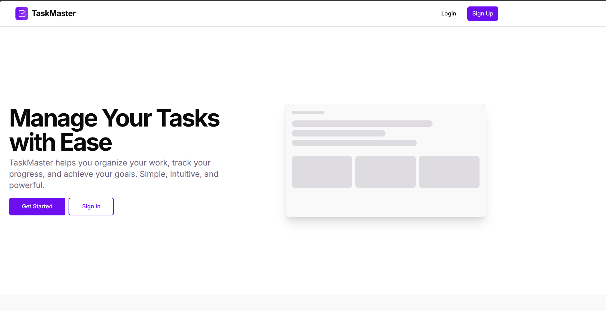

# 📛 Todo App Frontend

[](https://github.com/godcandidate/todo_frontend/actions/workflows/ci-cd.yml)
[](https://app.netlify.com/sites/your-site-name/deploys)

🔗 [Live Demo](#) (Add a working link if available)

Welcome to the Todo App! This project is the frontend interface of a simple and intuitive task management system, built using **Next.js**.

---

## 📑 Table of Content

- [About the Project](#about-the-project)
- [Features](#features)
- [Technologies Used](#technologies-used)
- [Screenshots](#screenshots)
- [Getting Started](#getting-started)
- [Docker Containerization](#docker-containerization)
- [Mock Login Credentials](#mock-login-credentials)
- [Project Structure](#project-structure)
- [Customization](#customization)
- [Deployment](#deployment)
- [Approach](#approach)
- [Status](#status)
- [Contributing](#contributing)
- [Credits](#credits)
- [License](#license)
- [Contact](#contact)

---

## 📚 About the Project

This Todo App serves as a simple task management tool aimed at helping users organize their daily activities efficiently. The project was created to explore the capabilities of Next.js for building modern, fast, and scalable front-end applications.

---

## Features

- **Role-Based Access Control:** Different dashboards and permissions for admin and regular users.
- **Admin Dashboard:** Complete task management with ability to create, edit, delete, and assign tasks to users.
- **User Dashboard:** View assigned tasks and update their status (Pending, In Progress, Completed).
- **Task Management:** Add, edit, and delete tasks with priority levels, categories, and due dates.
- **Search and Filter:** Advanced search capabilities to filter tasks by various criteria.
- **Responsive Design:** Enjoy a seamless experience across devices.
- **User-Friendly Interface:** Intuitive and easy-to-navigate layout with a modern purple theme.

---

## ☕️ 🐍 ⚛️ Technologies Used

- **Next.js** - React Framework for server-rendered applications
- **TypeScript** - Type-safe JavaScript
- **Tailwind CSS** - Utility-first CSS framework
- **Shadcn UI** - Component library
- **React Hook Form** - Form validation
- **Zod** - Schema validation
- **Docker** - Containerization

---

## 📷 Screenshots



---

## Getting Started

Follow these steps to set up the project on your local machine:

### Prerequisites

Ensure you have the following installed:

- [Node.js](https://nodejs.org/) (v16 or later)
- [npm](https://www.npmjs.com/) or [yarn](https://yarnpkg.com/)

### Installation

1. Clone the repository:

   ```bash
   git clone https://github.com/your-username/todo-app.git
   cd todo-app
   ```

2. Install dependencies:

   ```bash
   npm install
   # or
   yarn install
   ```

3. Start the development server:

   ```bash
   npm run dev
   # or
   yarn dev
   ```

4. Open your browser and navigate to:

   ```
   http://localhost:3000
   ```

5. Use the mock credentials provided in the [Mock Login Credentials](#mock-login-credentials) section to log in.

---

## Docker Containerization

This project includes Docker support for easy deployment and consistent environments.

### Building the Docker Image

```bash
# Build the Docker image
docker build -t todo-app .
```

### Running the Container

```bash
# Run the container in development mode
docker run -p 3000:3000 todo-app

# Or for production
docker run -p 3000:3000 -e NODE_ENV=production todo-app
```

### Docker Compose (Optional)

Create a `docker-compose.yml` file in the root directory:

```yaml
version: "3"

services:
  frontend:
    build: .
    ports:
      - "3000:3000"
    environment:
      - NODE_ENV=production
```

Then run:

```bash
docker-compose up
```

---

## Mock Login Credentials

Use these credentials to test the application:

### Admin User

- **Email:** john@example.com
- **Password:** password123
- **Role:** Admin
- **Features:** Full access to create, edit, delete, and assign tasks

### Regular User

- **Email:** jane@example.com
- **Password:** password123
- **Role:** User
- **Features:** Can view assigned tasks and update their status

### Guest User

- **Email:** guest@example.com
- **Password:** password123
- **Role:** User
- **Features:** Limited access to assigned tasks

---

## Project Structure

```plaintext
.
├── app/
│   ├── globals.css
│   ├── layout.tsx
│   └── page.tsx
├── components/
│   ├── ui/              # Reusable UI components
│   ├── todo-form.tsx    # Form for adding todos
│   └── todo-list.tsx    # Component displaying the todo list
├── hooks/
│   └── use-toast.ts     # Custom toast hook
├── lib/
│   ├── api.ts           # API integration logic
│   ├── types.ts         # Type definitions
│   └── utils.ts         # Helper functions
├── public/
│   └── todo-dashboard.png
├── styles/
│   └── globals.css      # Global styles
├── README.md
├── next.config.js
├── tailwind.config.ts
├── tsconfig.json
└── package.json
```

### Key Folders

- **`app/`**: Contains the main app layout and pages.
- **`components/`**: Includes reusable UI and page-specific components.
- **`hooks/`** Houses custom React hooks.
- **`lib/`**: Core utilities, API logic, and type definitions.
- **`public/`**: Assets like images and other static files.
- **`styles/`**: Global styling files.

---

## Customization

To tailor the app to your needs:

1. Modify the **UI** in `src/components/`.
2. Update **API calls** in `src/utils/api.js`.
3. Adjust **styles** in `src/styles/globals.css`.

---

## Deployment

To deploy the app:

1. Build the production-ready version:

   ```bash
   npm run build
   # or
   yarn build
   ```

2. Start the production server:
   ```bash
   npm start
   # or
   yarn start
   ```

You can also deploy it to platforms like [Vercel](https://vercel.com/) or [Netlify](https://www.netlify.com/).

---

## 🚶 Approach

The Todo App was developed using the following principles:

- Component-based architecture for reusable and maintainable code.
- API integration using RESTful design principles.
- Responsive web design for accessibility across devices.

---

## 📶 Status

This project is currently **in progress** with additional features and refinements underway.

---

## Contributing

Contributions are welcome! To contribute:

1. Fork the repository.
2. Create a new branch:
   ```bash
   git checkout -b feature/your-feature-name
   ```
3. Make your changes and commit them:
   ```bash
   git commit -m "Add your message here"
   ```
4. Push your changes:
   ```bash
   git push origin feature/your-feature-name
   ```
5. Open a pull request.

---

## 📝 Credits

- Built with ❤️ using [Next.js](https://nextjs.org/).
- Inspired by modern task management tools.
- Special thanks to contributors and open-source libraries that supported this project.

---

## License

This project is licensed under the [MIT License](./LICENSE).

---

## Contact

For questions or feedback, reach out via:

- Email: your.email@example.com
- GitHub: [your-username](https://github.com/your-username)
